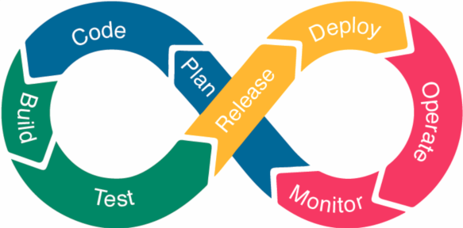

- [Index](../index.md)

---

# The DevOps Lifecycle

  
   
  <i>This documentation adheres to the Devops Lifecycle structure.</i>

## Lifecycle Phases

- [Phase 1: Planning](phase_01)
- [Phase 2: Code](phase_02)
- [Phase 3: Builds](phase_03)
- [Phase 4: Testing](phase_04)
- [Phase 5: Releases](phase_05)
- [Phase 6: Deployments](phase_06)
  - [6A. Administrative Prerequisites](phase_06#6a)
  - [6B. Resource Planning & Allocation](phase_06#6b)
  - [6C. Secrets & Credentials Management](phase_06#6c)
  - [6D. Resource Provisioning & Configuration](phase_06#6d)
  - [6E. Branding & Image Publishing](phase_06#6e)
  - [6F. Deployment Configurations](phase_06#6f)
  - [6G. Deployments](phase_06#6g)
  - [6H. Post Deployment](phase_06#6h)
- [Phase 7: Operations](phase_07)
  - [7A. Bug Fixes & Patches](phase_07#7a)
  - [7B. Maintenance & Updates](phase_07#7b)
  - [7C. Backups & Archiving](phase_07#7c)
- [Phase 8: Monitoring](phase_08)
- [Phase 9: End of Life](phase_09)
  - [9A. Deprecation](phase_09#9a)
  - [9B. Retirement](phase_09#9b)

### Additional Notes

- Any documentation detailing codebase specific procedures will be located in the relevant code repository (links to each of which can be found on the [resources](resources#top) page).
- Phases 1 through 5 (_Planning_, _Code_, _Builds_, _Testing_, _Releases_) will only contain documentation that is globally relevant to all `Core-*` projects and codebases.
- Phases 6 through 8 (_Deployments_, _Operations_ and _Monitoring_) are the primary focus of this documentation.
- The procedural documentation for Phase 9 is under development.

<a class="inline-navlink-page-top" href="#top">Back to Top</a>

---

- [Index](../index.md)
